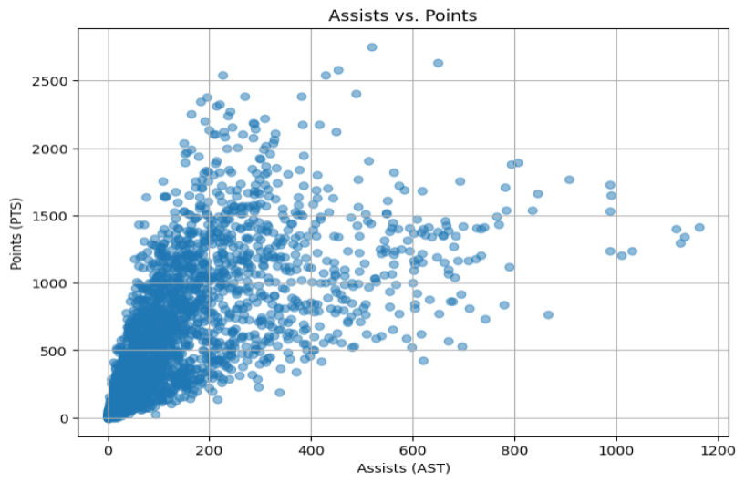
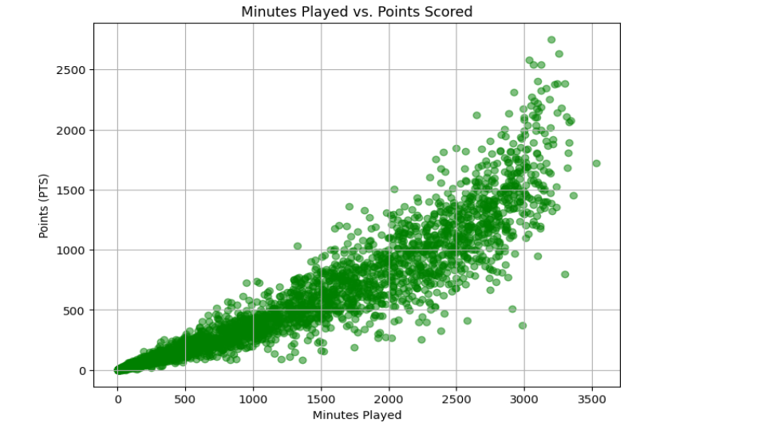
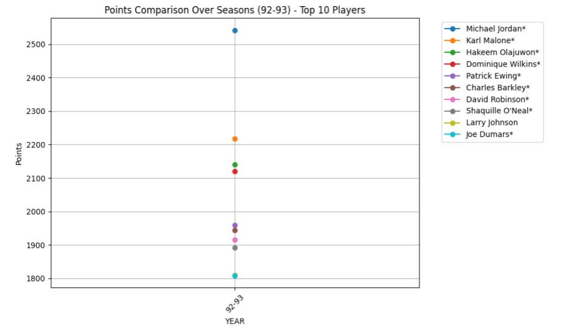
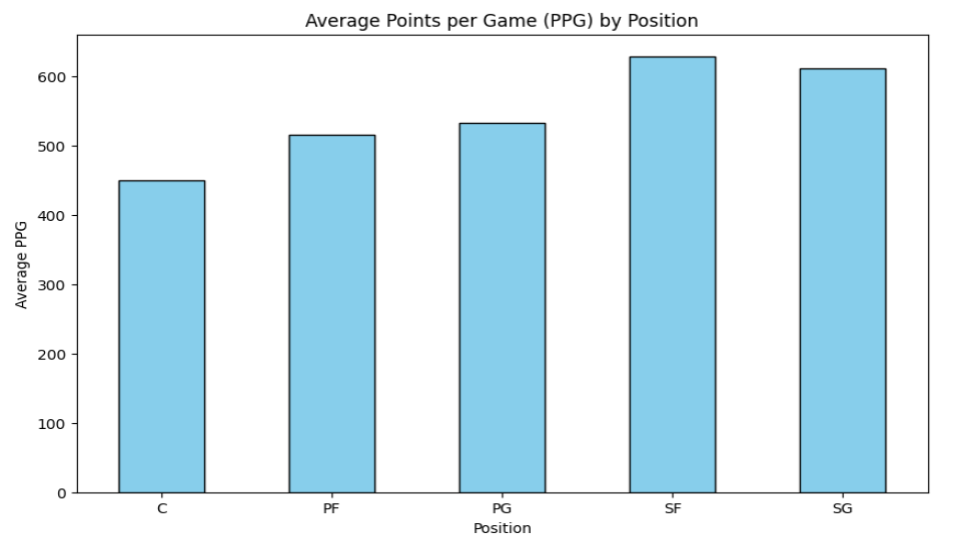

##  NBA Player Statistics Analysis

### Project Overview
This project performs exploratory data analysis and visualization on an NBA player statistics dataset to uncover scoring trends, efficiency patterns, and positional performance insights.

### Tools used
- Python  
- Pandas  
- Matplotlib / Seaborn  
- Jupyter Notebook  

---

### Dataset
The dataset contains 5459 rows and 26 columns, covering player stats across multiple NBA seasons. It includes metrics like points, assists, rebounds, minutes played, and team information.

---

### Key Analysis Performed
- Loaded and explored the dataset using Pandas  
- Checked and handled missing values  
- Removed duplicate entries and cleaned team data (like removing "TOT" rows)  
- Created new features such as Free Throw % and Total Rebounds  
- Analyzed scoring trends and player performance across seasons  

---

### Visual Insights
- Michael Jordan stood out as the highest scorer in the 1992–93 season  
- Players with more minutes generally scored more, but efficiency varied  
- The assists vs points plot helped identify strong playmakers  
- Scoring patterns differed across positions, with certain roles dominating offense
- Strong correlation between playing time and scoring output
- Certain positions dominate scoring contributions
- Playmaking ability identified through assists vs points analysis

---

### How to run this project
1. Open the notebook `nba_analysis.ipynb`  
2. Install required libraries  
3. Run all cells to reproduce the analysis and visualizations

## Visual Insights

**Assists vs Points**

**Minutes vs Points**

**Points Comparison**

**PPG by Position**

